# Slide 1 — Dashboard Skeleton (Razor + CSS)

**Status:** Done  
**Slides:** [DevPulse_1 on Google Slides](https://docs.google.com/presentation/d/1_EAkSfcNAW6q6c8elsMYhZ75GI4uQd-r4UIkOaBu7tw/edit?usp=sharing)  
**Repo:** [github.com/kelvintechnical/ta-devpulse](https://github.com/kelvintechnical/ta-devpulse) · **Site:** [kelvinintechconsulting.com](https://www.kelvinintechconsulting.com)

> **Goal:** Build the DevPulse home page shell — hero + five placeholder cards — and style it with a dark CSS Grid layout. **No API calls yet.**

**Next:** [Slide 2 — Live API Cards](../slide-02-live-api-cards/README.md) · [← README](../../README.md)

---

## Setup (before coding)

### Step 0 — Setup

---

Get .NET running and open the Razor Pages app in a browser.

## Before you start

Install these **before** the session:

- [.NET 8 SDK](https://dotnet.microsoft.com/download/dotnet/8.0)  
  Check: open a terminal and run:

```bash
dotnet --version
```

You should see something like `8.0.x`.

- Cursor or VS Code with C# support  
- A free [Azure](https://azure.microsoft.com/free/) account (for Step 7; can finish later if signup is slow)  
- This repo cloned or opened on your machine  

---

### Goal
Run a Razor Pages app in the browser.

### Why
You need a working project before any APIs. `dotnet` is the tool that creates, builds, and runs C# web apps.

### If the `DevPulse/` folder is already in this repo
Someone may have run the template once for you. That’s only scaffolding (default Welcome page). Open it and run:

```bash
cd DevPulse
dotnet run
```

### If you are creating the project yourself
From the repo root (`ta-devpulse` / `DevPulse` parent folder):

```bash
dotnet new webapp -n DevPulse -o DevPulse
cd DevPulse
dotnet run
```

### What those commands mean

| Command | Meaning |
|---|---|
| `dotnet new webapp` | Create a new Razor Pages web app from a template |
| `-n DevPulse` | Project name |
| `-o DevPulse` | Output folder name |
| `dotnet run` | Build and start a local web server |

### Syntax peek — `Program.cs`
Open `DevPulse/Program.cs`. You should see something like:

```csharp
var builder = WebApplication.CreateBuilder(args);
builder.Services.AddRazorPages();
var app = builder.Build();
// ...
app.MapRazorPages();
app.Run();
```

| Piece | Meaning |
|---|---|
| `var builder = ...` | Starts configuring the web app |
| `AddRazorPages()` | Turns on Razor Pages |
| `app.Run()` | Starts listening for browser requests |

### Checkpoint
- Terminal prints a URL like `http://localhost:5xxx` or `https://localhost:7xxx`  
- Opening it shows the default Welcome page  

Stop the server with `Ctrl+C` when you move to the next edit (or leave it running and restart after big changes).

---

## Build the skeleton + CSS

### Slide 1 — Dashboard Skeleton (Razor + CSS)

---

**Goal:** Build the DevPulse home page shell — hero + five placeholder cards — and style it with a dark CSS Grid layout. **No API calls yet.**

**Files you edit:**
- `DevPulse/Pages/Index.cshtml`
- `DevPulse/wwwroot/css/site.css`

**How to use this guide:** Read each mini-step → type the code → run → hit the checkpoint → look at the image.

---

## Tips before you start

### Run the app

```bash
cd DevPulse
dotnet run
```

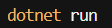

When it works, the terminal shows something like:

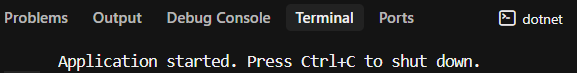

### Hard refresh after CSS changes

If the page looks unchanged after editing CSS, press **Ctrl + Shift + R**:


---

## 1.1 — What is a `.cshtml` file?

A `.cshtml` file is **HTML that can also run C#**.  
The server processes it first; the browser only receives finished HTML.

| File | What happens |
|---|---|
| `.html` | Browser gets exactly what you wrote (static) |
| `.cshtml` | Server runs C# snippets, then sends HTML |

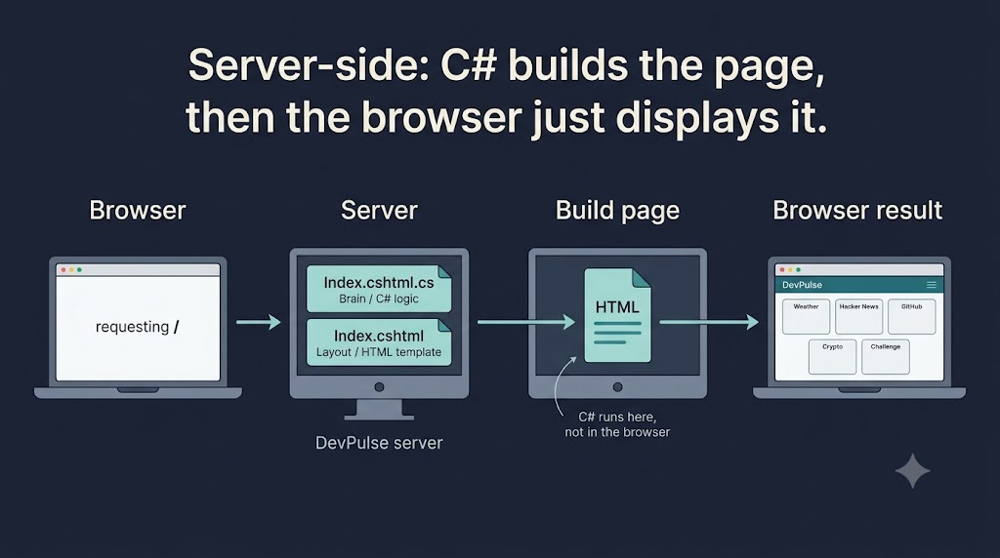

**Checkpoint:** Explain `.cshtml` vs `.html` in one sentence.

---

## 1.2 — `@page`, `@model`, and `@{ }`

Open `DevPulse/Pages/Index.cshtml`. Start the file with:

```cshtml
@page
@model IndexModel

@{
    ViewData["Title"] = "DevPulse";
    // ViewBag.Title = "DevPulse"; // strongly typed alternative
}
```

| Line | Meaning |
|---|---|
| `@page` | This file is a routable Razor Page (home = `/`) |
| `@model IndexModel` | Connects to `Index.cshtml.cs` |
| `@{ }` | C# territory — code, not HTML |

**Checkpoint:** File starts with `@page`, `@model`, then a `@{ }` block.

---

## 1.3 — Hero + five card shells

Still in `Index.cshtml`, replace the Welcome content with the layout below.

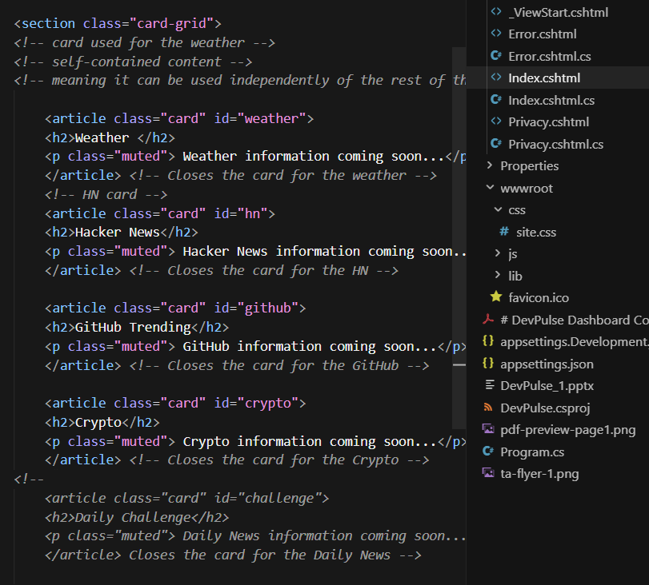

```cshtml
<section class="hero">
    <h1>DevPulse</h1>
    <p class="tagline">Live developer pulse - APIs in C#</p>
</section>

<section class="card-grid">
    <article class="card" id="weather">
        <h2>Weather</h2>
        <p class="muted">Weather information coming soon...</p>
    </article>

    <article class="card" id="hn">
        <h2>Hacker News</h2>
        <p class="muted">Hacker News information coming soon...</p>
    </article>

    <article class="card" id="github">
        <h2>GitHub Trending</h2>
        <p class="muted">GitHub information coming soon...</p>
    </article>

    <article class="card" id="crypto">
        <h2>Crypto</h2>
        <p class="muted">Crypto information coming soon...</p>
    </article>

    <article class="card" id="challenge">
        <h2>Daily Challenge</h2>
        <p class="muted">Daily News information coming soon...</p>
    </article>
</section>
```

**Why skeleton first:** if layout is wrong, API data has nowhere useful to land.

**Checkpoint:** Five titled cards + hero render (stacked / unstyled is OK).

---

## 1.4 — Comment rules (`//` vs `<!-- -->`)

| Territory | Use |
|---|---|
| Inside `@{ }` (C#) | `//` or `/* */` |
| Outside `@{ }` (markup) | `<!-- -->` |

**Never** put `//` on `@page` / `@model`.  
**Never** put `<!-- -->` inside `@{ }`.

```cshtml
@page
<!-- This is the Index page Razor view -->
@model IndexModel

@{
    // Opening of the Razor code block
    ViewData["Title"] = "DevPulse";
}
```

**Checkpoint:** No `//` on directives; no HTML comments inside C# blocks.

---

## 1.5 — What is `wwwroot`?

`wwwroot` is the **public** folder. Browsers can request files by URL (`/css/site.css`).

| Path | Side | Processed? |
|---|---|---|
| `Pages/Index.cshtml` | Server (private) | Yes — Razor runs here |
| `wwwroot/css/site.css` | Client (public) | No — sent as-is |

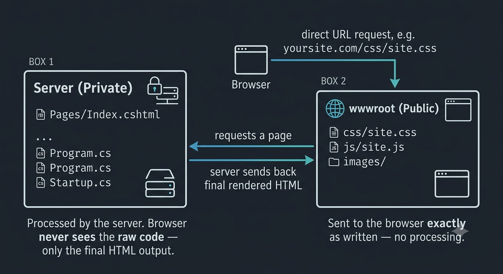

This is **separation of concerns** (different jobs in different places) — not abstraction.

**Action:** Open `DevPulse/wwwroot/css/site.css`.

**Checkpoint:** Everyone has `site.css` open.

---

## 1.6 — Clear template CSS

Delete unused template rules (font-size media queries, focus shadows, etc.). Keep a clean file so we can rebuild the theme.

**Checkpoint:** `site.css` is ready for our rules only.

---

## 1.7 — `body` dark theme base

Type:

```css
body {
  margin-bottom: 60px;
  font-family: "Segoe UI", system-ui, sans-serif;
  background: #0f1419;
  color: #e7ecf1;
}
```

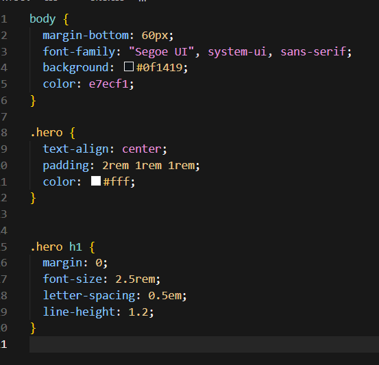

After refresh, the page background should go dark (cards may still look white/stacked):

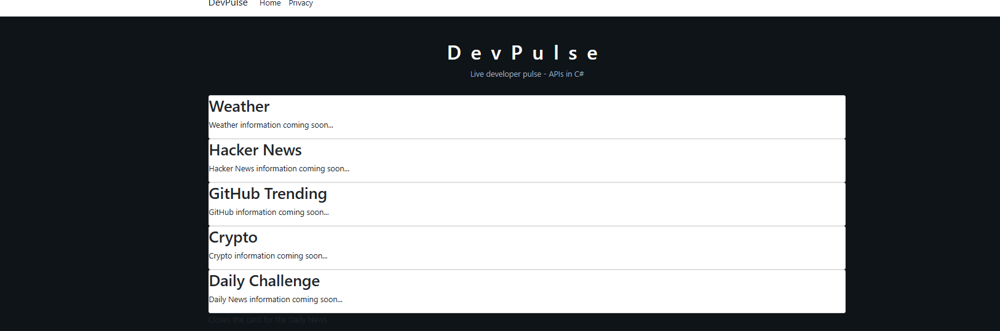

**Checkpoint:** Page background is dark after refresh (use hard refresh if needed).

---

## 1.8 — `.hero` banner

```css
.hero {
  text-align: center;
  padding: 2rem 1rem 1rem;
  color: #fff;
}

.hero h1 {
  margin: 0;
  font-size: 2.5rem;
  letter-spacing: 0.5em;
  line-height: 1.2;
}
```

**Checkpoint:** Title is centered and letter-spaced.

---

## 1.9 — `.tagline` muted subtitle

```css
.tagline {
  color: #9aa7b5;
  margin-top: 0.5rem;
}
```

**Checkpoint:** Tagline is dimmer than the title.

---

## 1.10 — Start `.card-grid` (`display: grid`)

```css
.card-grid {
  display: grid;
}
```

Cards may still look full-width until columns are set — that’s expected.

**Checkpoint:** Rule exists; no syntax errors.

---

## 1.11 — `grid-template-columns` (`auto-fit`)

```css
  grid-template-columns: repeat(auto-fit, minmax(260px, 1fr));
```

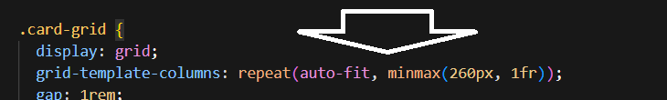

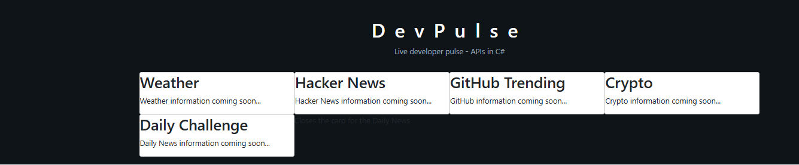

**Checkpoint:** Cards sit side-by-side on a wide window; wrap on a narrow one.

---

## 1.12 — `gap`

```css
  gap: 1rem;
```

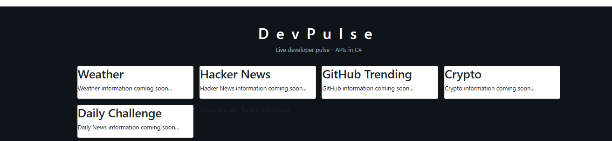

**Checkpoint:** Visible gutter between cards.

---

## 1.13 — `padding`

```css
  padding: 1rem;
```

Partial rule so far:

```css
.card-grid {
  display: grid;
  grid-template-columns: repeat(auto-fit, minmax(260px, 1fr));
  gap: 1rem;
  padding: 1rem;
}
```

**Checkpoint:** Cards aren’t kissing the viewport edges.

---

## 1.14 — Why aren’t all 5 on one row?

`auto-fit` + `minmax(260px, …)` wraps by design. If the window only fits four 260px columns, the fifth card wraps — that’s correct.

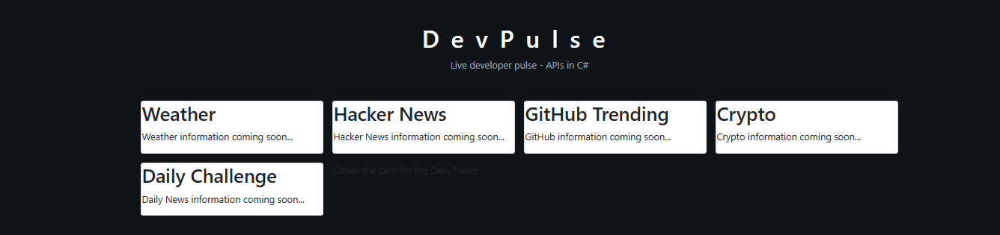

**Checkpoint:** Room understands wrap is intentional.

---

## 1.15 — Force five columns (lab layout)

For a wide projector / lab screen, switch to:

```css
  grid-template-columns: repeat(5, 1fr);
```

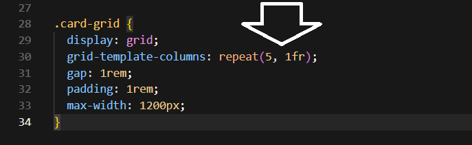

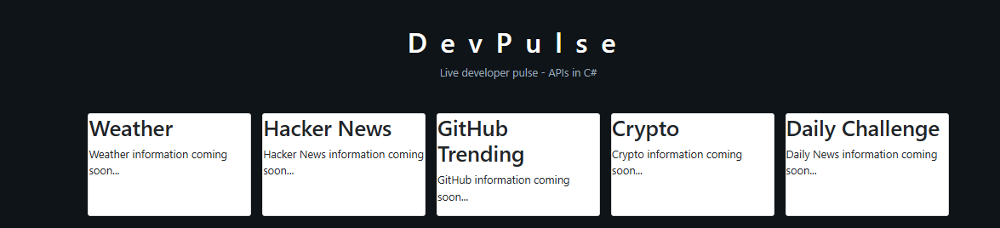

**Trade-off:** Great for training screens; less mobile-friendly than `auto-fit`.

**Checkpoint:** All five cards on one row (wide window).

---

## 1.16 — Center the grid

```css
  max-width: 1200px;
  margin: 0 auto 3rem;
```

Full `.card-grid` target:

```css
.card-grid {
  display: grid;
  grid-template-columns: repeat(5, 1fr);
  gap: 1rem;
  padding: 1rem;
  max-width: 1200px;
  margin: 0 auto 3rem;
}
```

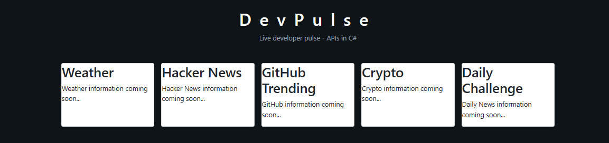

**Checkpoint:** Grid is centered with space underneath.

---

## 1.17 — Style `.card` panels

```css
.card {
  background: #1b222a;
  color: #fff;
  border: 1px solid olive;
  border-radius: 12px;
  padding: 1.5rem;
  min-height: 150px;
}
```

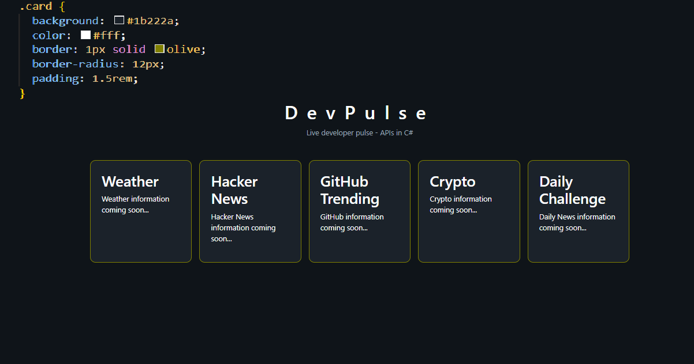

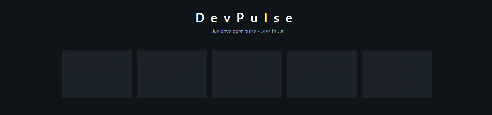

**Checkpoint:** Five dark olive-bordered cards.

---

## 1.18 — Titles + muted text (+ API-ready helpers)

```css
.card h2 {
  margin: 0 0 0.75rem;
  font-size: 1.1rem;
  color: #7dd3fc;
}

.muted {
  color: #9aa7b5;
}

.error {
  color: #fca5a5;
}

.card ul {
  padding-left: 1.1rem;
  margin: 0;
}

.card li {
  margin-bottom: 0.35rem;
}

.card a {
  color: #93c5fd;
}
```

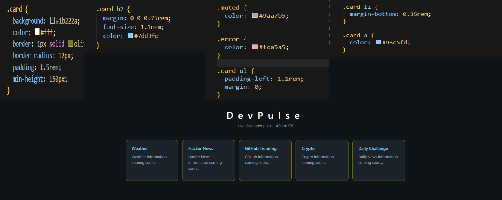

**Checkpoint:** Blue titles, muted placeholders, full card toolkit in CSS.

---

## Slide 1 done when

- [x] Dark background + light text  
- [x] Centered DevPulse hero + muted tagline  
- [x] Five cards in a centered grid  
- [x] Dark card panels + blue titles  
- [x] Correct comment syntax in C# vs HTML  

**Next:** [Step 2 — Weather](../slide-02-live-api-cards/01-weather.md) — first live `HttpClient` call.

---

## Slide 1 checkpoint

- [ ] App runs with `dotnet run`
- [ ] Dark theme + centered hero
- [ ] Five styled cards in a grid
- [ ] Comments use the correct syntax

**When finished →** [Slide 2 — Live API Cards](../slide-02-live-api-cards/README.md)
